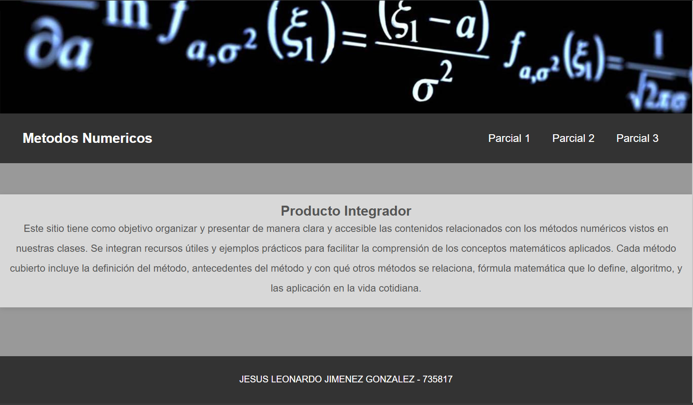
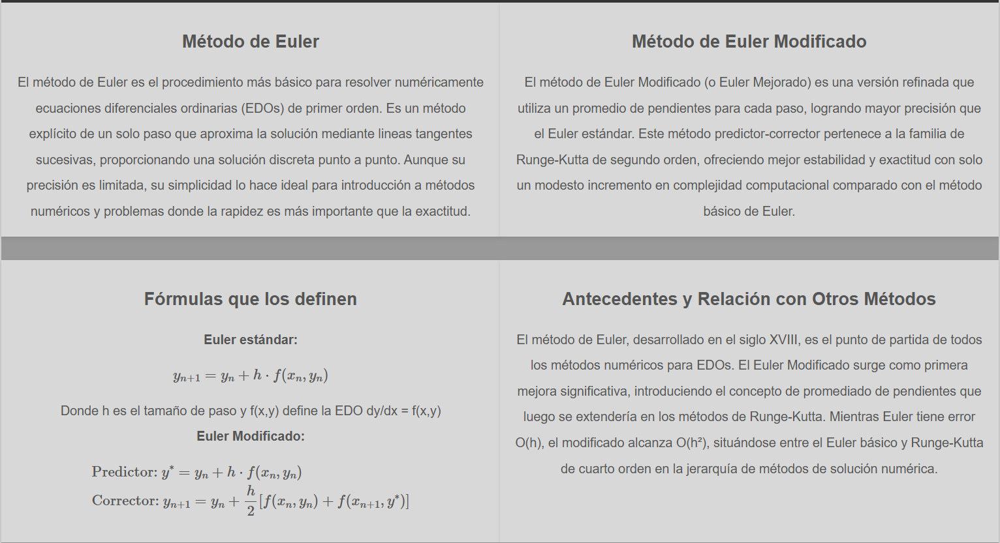
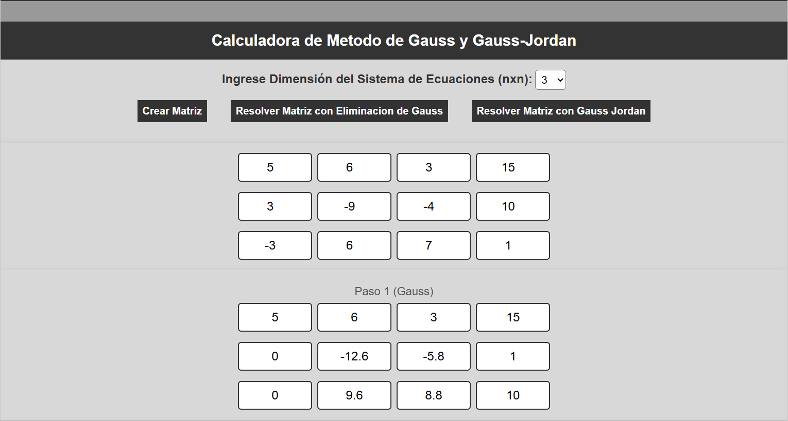

# Proyecto Final – Métodos Numéricos

Este proyecto es una página web desarrollada como producto integrador del curso de **Métodos Numéricos**, donde se recopilan, explican e ilustran diferentes métodos numéricos vistos a lo largo del semestre. Su propósito es servir como herramienta educativa para estudiantes que cursen o deseen repasar estos temas.

## Enlace al proyecto

[Visita la página web aquí](https://glowing-sprite-5524f7.netlify.app/)

---

## Contenido del sitio

El contenido está organizado en tres secciones principales, correspondientes a los tres parciales del curso:

### Parcial 1 – Ecuaciones Lineales y No Lineales
- Método de Bisección  
- Método de Newton-Raphson  
- Método de la Secante  
- Método de Punto Fijo  
- Eliminación de Gauss  
- Gauss-Jordan  

### Parcial 2 – Ajuste de curvas y sistemas lineales iterativos
- Método de Gauss-Seidel  
- Método de Jacobi  
- Método de Montante (con calculadora interactiva)  
- Interpolación de Lagrange  
- Regresiones (lineal, cuadrática, etc.)

### Parcial 3 – Derivación, Integración y Ecuaciones Diferenciales
- Diferencias Divididas  
- Método del Trapecio  
- Método de Simpson 1/3 y 3/8  
- Romberg y Richardson  
- Método de Euler (simple y modificado)  
- Método de Runge-Kutta

---

## Manual de Usuario

Cada método cuenta con:
- Definición teórica
- Aplicaciones
- Fórmulas y algoritmos
- Ejemplo resuelto paso a paso
- Calculadoras (para algunos métodos como Montante)

---

## Autor

**Jesus Leonardo Jimenez Gonzalez** 
Carrera: Ingeniería en Tecnologías Computacionales  

---

## Capturas de pantalla

### Página principal

### Página del Método de Euler y Euler Modificado

### Ejemplo de Calculadora

